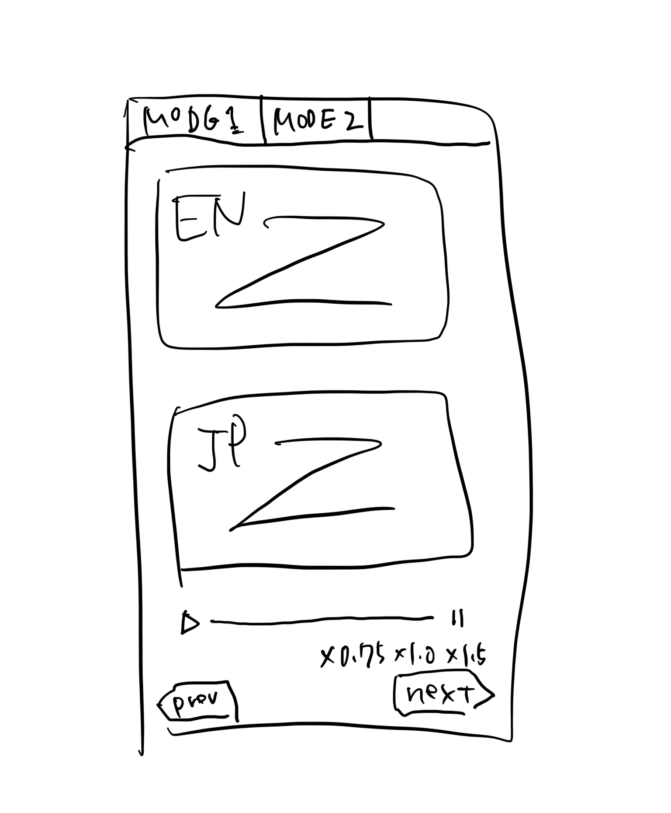

# Requirement

英語のリスニングアプリを作成したい

- S3 による静的ウェブホスティング ＋ CloudFront ＋ Route53 を活用し独自ドメイン（example.com）として HTTPS アクセスできるものを想定している
- ２つのモードがあり、日常会話モードと AWS re:Invent のような技術カンファレンスでのセッションの聴講に備えるモードを用意したい
- 画面構成は  にあるようなものを想定しており、読み上げられる英文と日本語翻訳、音声コントローラーが備わっているイメージです
- 日常会話モードでは中学英語レベルから徐々にレベルが上がっていくような想定で良い
- 技術カンファレンスに備えたモードは一旦 AWS に閉じた話に終始して良い
- それぞれをまずは 20 問作成したい
- 音声読み上げは Amazon Polly の利用で良い
- 学習履歴などの記録などは一旦備えなくて良い
- Route53 のパブリックホストゾーンは AWS アカウント <PARENT_ACCOUNT_ID> に存在し、リスニングアプリは AWS アカウント <APP_ACCOUNT_ID> に構築したい
- なお、<APP_ACCOUNT_ID> は別途、別プロダクト（スマートフォンアプリ）の本番公開もしているため留意が必要
- それぞれの AWS アカウントでの作業が必要になった場合は、AWS CLI の認証情報を取得するので適宜作業依頼をしてほしい